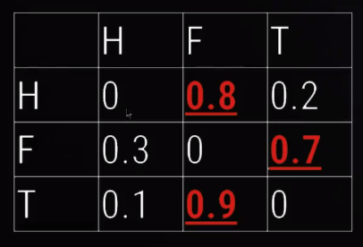
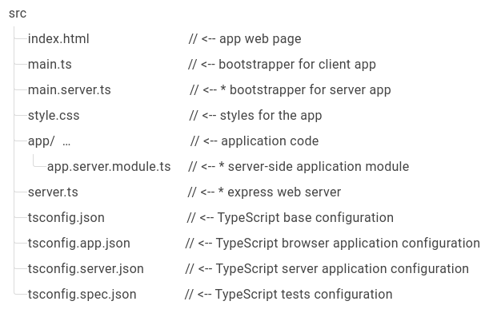

# Curso de rendimiento en angular

## Analizando el tamaño del bundle

### Bundle size

Este concepto significa cuanto pesa en bytes tu aplicación en angular. Por lo general cuando se compila en angular, generamos varios archivos Javascript: **main.js**, vendor.js, runtime.js y los archivos modularizables que se hayan creado por medio del lazy loading.

El navegador debe realizar una serie de procesos para poder cargar nuestro sitio web.primero lanza un request a nuestro index.html o a html raiz en donde leera linea a liena para ir descubriendo los recursos que debe ir descargando, recursos como imagenes, archivo de estilos y archivos javascript.

El en caso de javascript debe realizar 4 pasos:

- Descargarlo,
- Parsearlo,
- Compilarlo
- Ejecutarlo.

El paso que mas suele tardarse es la descargar ya que entre mas pesado sea el archivo mas lento sera la descarga.

### Tree skaking

Es una técnica en la cual removemos las librerías y código que no se utiliza en la app.

### Implementando webpack bundle Analyzer

Para instalarlo usamos el siguiente comando:

```txt
npm install webpack-bundle-analyzer --save-dev
```

Luego de instalarlo como dependencia de desarrollo, debemos generar un build de nuestra aplicación con el siguiente comando:

```txt
ng build --stats-json
```

Este comando nos va a genarar el build para producción de nuestra aplicación ademas de un archivo json llamado **stats.json** que será leido por nuestro webpack-bundle-analyzer.

Para leer el archivo **stats.json** con **webpack-bundle-analyzer** debemos utilizar el siguiente comando:

```txt
npx webpack-bundle-analyzer dist/project_name/stats.json
```

Estos nos va ejecutar **webpack-bundle-analyzer** y nos lanzara un navegador con las estadisticas de perso de nuestra aplicación.

### bundlephobia

Es una pagina web en la cual podemos ver cuando pesa una librería ademas de eso ver alternativas a la libreria buscada para conocer si existen opciones mas livianas pero sobre todo que cumplan con nuestros requerimientos.

```txt
https://bundlephobia.com/
```

### Performace budget calculetor

Es una herramienta en la cual podemos colocar el peso de nuestros archivos, html, css, js y nos indicara de carga del sitio.

```txt
https://perf-budget-calculator.firebaseapp.com/
```

Ademas de eso en el angular.json en la seccion configurations.production.budget podemos configurar el tamaño minimo y maximo que pueden pensar nuestas aplicaciones para que el mismo angular nos indique si hemos excedido ese peso.

## Aumentando la velocidad de navegación

### Code splitting a nivel de rutas

Una de las buenas practicas en angular es utilizar la modularización, es decir que dividir nuestra aplicación en modulos y llamarlos cuando el usuario realmente los necesite, eso lo hacemos por medio de lazy loading. Pero angular tambien nos provee diferentes formas de ir cargando los modulos, esto se conoce como estrategias de precarga de modulos.

Primero debemos ir al app-routing y agrear la configuración necesaria para implementar la estrategia de precarga de modulos.

Este es el modulo tal cual como lo crea angular:

```ts
@NgModule({
  imports: [RouterModule.forRoot(routes)],
  exports: [RouterModule]
})
```

### Estrategias de precarga

- **PreloadAllModules:** Es una estrategia que angular nos provee en donde se irá precargando todos los modulos cada vez que el navegador tenga espacio para esta tarea. Es recomendable usarla cuando el proyecto es pequeño ya que tendra pocos modulos para ir cargando en segundo plano.

  ```ts
  @NgModule({
    imports: [RouterModule.forRoot(routes, {
    preloadingStrategy: PreloadAllModules
    })],
    exports: [RouterModule]
  })
  ```

- **Estrategía de precarga personalizada:** Angular nos brinda la posibilidad de crear nuestras propias estrategías de precarga para poder precargar los modulos que nosotros necesitemos.

  Para relizar esta estrategía, debemos generar un servicio que implemente la clase **PreloadingStrategy** la cual tiene un metodo llamada preload.

  ```ts
  import { Injectable } from "@angular/core";
  import { PreloadingStrategy, Route } from "@angular/router";
  import { Observable, of } from "rxjs";

  @Injectable({
    providedIn: "root",
  })
  export class CustomPreloadService implements PreloadingStrategy {
    preload(route: Route, load: () => Observable<any>): Observable<any> {
      if (route.data && route.data["preload"]) {
        return load();
      }
      return of(null);
    }
  }
  ```

  Basicamente en la implementación del método preload estamos verificando que el componente o modulo que se va a acceder desde su ruta tenga algún parametro, en este caso llado **preload**, y si lo tiene entonces sera precargado.

  ```ts
  ...
  {
    path: '',
    loadChildren: () => import('./website/website.module').then(m => m.WebsiteModule),
    data: {
      preload: true
    }
  },
  ...
  ```

- **QuicklinkStrategy:** Es una estrategia creada por la comunidad en la cual se iran precargando los modulos a medida que se detecte su link de acceso en la pantalla, es decir que si en pantalla aparece un link que vaya al componente home, dicho componente sera precargado.

  Para implementar esta estrategia debemos instalar el siguiente paquete

  ```txt
  npm i ngx-quicklink --save
  ```

  Luego de su instalación, debemos hacer su configuración en el app-routing.module.

  ```ts
  import { QuicklinkStrategy } from 'ngx-quicklink';

  @NgModule({
  imports: [RouterModule.forRoot(routes, {
    preloadingStrategy: QuicklinkStrategy
  })],
  exports: [RouterModule]
  })
  ```

  Luego de configurar el app-routing.module debemos importar el **QuicklinkModule** en cada uno de los modulos o componentes que tenga ruta hacia otros.

### Usando machine learning para predecir rutas

Por medio de un modelo predictivo se puede determinar cual va a ser el modulo que se va a precargar. Para realizar este modelo se utilizán las cadenas de marckov. Las cadenas de Markov permiten visualizar cada una de las probabilidades que se tienen en la navegación de la aplicación. Evalúa la probabilidad que tiene cada una de las vistas de la aplicación frente a un comportamiento previo de los usuarios, generando un modelo de predicción de precarga de módulos, con el fin de mejorar el rendimiento y la experiencia de usuario mientras navega por la aplicación web.

Podemos representar las cadenas de markov por medio de nodos:


O tambien en una tabla



En los ejemplos anterios solo se trabajo con tres posibles rutas pero en una aplicación real pueden haber muchos componentes.

Para poder realizar este modelo predictivo necesitamos data de los usuarios, es decir que primero debemos lanzar nuestra aplicación al publico para poder obtener información que servira para nutrir nuestro modelo predictivo.

En base a esta teoria, el equipo de Google desarrollo una librería llamada guess.js la cual se alimenta de datos obtenidos de google analitycs para generar un modelo predictivo en base al modelo de markov utilizando tensor flow, luego ese modelo predictivo lo añade a los assests del proyecto para que una vez que este en ejecucíon empiece a cargar los modulos con mayor probabilidad de acceso en base a la ruta actual.

#### Configuración

Lo primero que se configuro fue google analitycs por medio de firebase siguiendo el siguiente [post](https://usecsv.com/community/firebase-analytics-angular).

Ua vez configurado google analitycs implementamos [guess.js](https://guess-js.github.io/docs/angular). En la sección de configurar el archivo **extend.webpack.config.js** podemos aplicar un modelo predictivo creado a mano o por medio de google analitycs pero a la fecha esta bloqueda la conexión.

### PWA con angular

Por favor hacer el [siguiente curso](https://platzi.com/clases/1818-pwa-angular/26022-bienvenida-e-introduccion-al-curso/) para tener un mayor contexto de como funcionan las PWA con angular

### SSR (Server side rendering)

El server side rendering (o renderizado en la parte del servidor) se basa en la posibilidad de poder renderizar el HTML de nuestro componente en cadenas de texto en la parte del servidor en lugar del cliente. Estas cadenas de texto serán la respuesta que nuestro servidor devolverán a las peticiones de nuestra web. En vez de funciones que manipulen en DOM en el navegador, delegamos este renderizado a una fase anterior en el servidor.

El SSR nos ayuda en 3 puntos clases:

- SEO: Posicionamiento en los motores de busqueda.
- Performance: Ya que el renderizano se hace desde el servidor.
- First page: Ya que se hace desde back, la carga inicial va ser mucho mas rapida.

Para implementar el SSR en angular, lo primero que debemos hacer es visitar la [pagina oficial](https://angular.io/guide/universal) para conocer los comandos mas actualizados. Para este caso el comando para utilizar angular universal y el SSR es:

```txt
ng add @nguniversal/express-engine
```

Este comando va a crear un servidor en express que nos va a permitir ejecutar el SSR de manera local a modo de desarrollo. Ademas de eso tambien va a crear y modificar algunos archivos:



Para ejecutar el proyecto es con el siguiente comando:

```txt
npm run dev:ssr
```

**Una de las cosas a tener en cuenta** cuando se trabaja con SSR es que algunas funciones como **localstorage** no estaran disponibles ya que ahora toda esas funciones vienen desde el servidor y por ejemplo **localstorage** solo funciona en el navegador. Para solucionar esto podemos hacer una configuración en la cual indicamos que funciones son para el navegador y cuales para el servidor.

```ts
import { Injectable, Inject, PLATFORM_ID } from "@angular/core";
import { isPlatformBrowser } from "@angular/common";
import { environment } from "../../environments/environment";

@Injectable({
  providedIn: "root",
})
export class StorageService {
  constructor(@Inject(PLATFORM_ID) private platformId: Object) {}

  private getStorage() {
    if (isPlatformBrowser(this.platformId)) {
      return environment.isLocalStorage ? localStorage : sessionStorage;
    }

    return null;
  }

  private storage = this.getStorage();

  public saveItem = (key: string, value: unknown): void => {
    if (isPlatformBrowser(this.platformId)) {
      this.storage?.setItem(key, JSON.stringify(value));
    }
  };

  public getItem = (key: string): any => {
    if (isPlatformBrowser(this.platformId)) {
      JSON.parse(`${this.storage?.getItem(key)}`);
    }
  };

  public removeItem = (key: string) => {
    if (isPlatformBrowser(this.platformId)) {
      this.storage?.removeItem(key);
    }
  };
}
```

Con esta configuración nos aseguramos de que funcionalidades van a estar del lado del servidor y cuales del cliente.

## Rendimiento en tiempo de ejecución

### Estrategia de detección de cambios

En ocasiones nos encontramos con el problema de que tenemos algunos componentes que se reutilizan en la misma pagina, a primera vista no se ve algún problema con ello pero cuando se inspecciona un poco más a fondo el funcionamiento de estos componentes vemos que si alteramos alguno de ellos, el otro tambien se ve afectado. Esto se debe a la estrategia de detección de cambios que posee Angular por defecto, la cual consiste en redibujar todo si llega a detectar un cambio en el DOM.

Para poder optimizar este comportamiento y solo modificar el componente que se ha actualizado debemos usar la estrategia de detección de cambios llamada onPush.

```ts
import { ..., ChangeDetectionStrategy } from '@angular/core';

@Component({
  selector: 'app-random-list',
  templateUrl: './random-list.component.html',
  styleUrls: ['./random-list.component.scss'],
  changeDetection: ChangeDetectionStrategy.OnPush
})

```

Al aplicar esta estrategia de precarga notaremos que ahora solo se re-dibuja el componente modificado.

### Pipes y funciones puras

Las **funciones puras** son aquellas que sin importar cuantas veces ejecutes una funcion con los mismos parametros siempre va a dar el mismo resultado.

Este concepto lo usa angular en sus **pipes** para poder procesar información y utilizar una tecnica llamada **Memoize**, la cual se encarga de memorizar un valor previamente calculado y solo lo va a cambiar cuando se actualice ese valor, en caso contrario lo traera de la cache.

Para conocer un poco mas sobre el [Momoize](https://www.freecodecamp.org/news/understanding-memoize-in-javascript-51d07d19430e/).

Los pipes puros son aquellos que utilizan las funciones puras y la tecnica Memoize para no tener que recalcular los valores. Los pipes por defectos son puros pero se tiene la posibilidad de cambiarlo a impuro, si se llega a dar este caso se recomienda comprender en porque se hizo ese cambio y en lo posible dejarlo como puro
