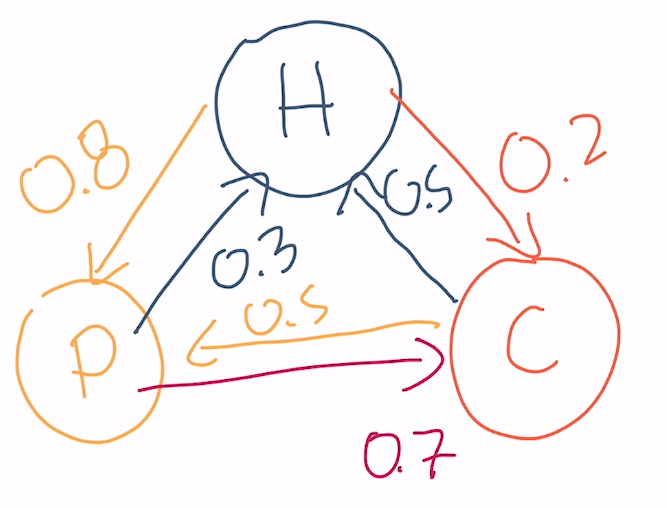

# Curso de rendimiento en angular

## Analizando el tamaño del bundle

### Bundle size

Este concepto significa cuanto pesa en bytes tu aplicación en angular. Por lo general cuando se compila en angular, generamos varios archivos Javascript: **main.js**, vendor.js, runtime.js y los archivos modularizables que se hayan creado por medio del lazy loading.

El navegador debe realizar una serie de procesos para poder cargar nuestro sitio web.primero lanza un request a nuestro index.html o a html raiz en donde leera linea a liena para ir descubriendo los recursos que debe ir descargando, recursos como imagenes, archivo de estilos y archivos javascript.

El en caso de javascript debe realizar 4 pasos:

- Descargarlo,
- Parsearlo,
- Compilarlo
- Ejecutarlo.

El paso que mas suele tardarse es la descargar ya que entre mas pesado sea el archivo mas lento sera la descarga.

### Tree skaking

Es una técnica en la cual removemos las librerías y código que no se utiliza en la app.

### Implementando webpack bundle Analyzer

Para instalarlo usamos el siguiente comando:

```txt
npm install webpack-bundle-analyzer --save-dev
```

Luego de instalarlo como dependencia de desarrollo, debemos generar un build de nuestra aplicación con el siguiente comando:

```txt
ng build --stats-json
```

Este comando nos va a genarar el build para producción de nuestra aplicación ademas de un archivo json llamado **stats.json** que será leido por nuestro webpack-bundle-analyzer.

Para leer el archivo **stats.json** con **webpack-bundle-analyzer** debemos utilizar el siguiente comando:

```txt
npx webpack-bundle-analyzer dist/project_name/stats.json
```

Estos nos va ejecutar **webpack-bundle-analyzer** y nos lanzara un navegador con las estadisticas de perso de nuestra aplicación.

### bundlephobia

Es una pagina web en la cual podemos ver cuando pesa una librería ademas de eso ver alternativas a la libreria buscada para conocer si existen opciones mas livianas pero sobre todo que cumplan con nuestros requerimientos.

```txt
https://bundlephobia.com/
```

### Performace budget calculetor

Es una herramienta en la cual podemos colocar el peso de nuestros archivos, html, css, js y nos indicara de carga del sitio.

```txt
https://perf-budget-calculator.firebaseapp.com/
```

Ademas de eso en el angular.json en la seccion configurations.production.budget podemos configurar el tamaño minimo y maximo que pueden pensar nuestas aplicaciones para que el mismo angular nos indique si hemos excedido ese peso.

## Aumentando la velocidad de navegación

### Code splitting a nivel de rutas

Una de las buenas practicas en angular es utilizar la modularización, es decir que dividir nuestra aplicación en modulos y llamarlos cuando el usuario realmente los necesite, eso lo hacemos por medio de lazy loading. Pero angular tambien nos provee diferentes formas de ir cargando los modulos, esto se conoce como estrategias de precarga de modulos.

Primero debemos ir al app-routing y agrear la configuración necesaria para implementar la estrategia de precarga de modulos.

Este es el modulo tal cual como lo crea angular:

```ts
@NgModule({
  imports: [RouterModule.forRoot(routes)],
  exports: [RouterModule]
})
```

### Estrategias de precarga

- **PreloadAllModules:** Es una estrategia que angular nos provee en donde se irá precargando todos los modulos cada vez que el navegador tenga espacio para esta tarea. Es recomendable usarla cuando el proyecto es pequeño ya que tendra pocos modulos para ir cargando en segundo plano.

  ```ts
  @NgModule({
    imports: [RouterModule.forRoot(routes, {
    preloadingStrategy: PreloadAllModules
    })],
    exports: [RouterModule]
  })
  ```

- **Estrategía de precarga personalizada:** Angular nos brinda la posibilidad de crear nuestras propias estrategías de precarga para poder precargar los modulos que nosotros necesitemos.

  Para relizar esta estrategía, debemos generar un servicio que implemente la clase **PreloadingStrategy** la cual tiene un metodo llamada preload.

  ```ts
  import { Injectable } from "@angular/core";
  import { PreloadingStrategy, Route } from "@angular/router";
  import { Observable, of } from "rxjs";

  @Injectable({
    providedIn: "root",
  })
  export class CustomPreloadService implements PreloadingStrategy {
    preload(route: Route, load: () => Observable<any>): Observable<any> {
      if (route.data && route.data["preload"]) {
        return load();
      }
      return of(null);
    }
  }
  ```

  Basicamente en la implementación del método preload estamos verificando que el componente o modulo que se va a acceder desde su ruta tenga algún parametro, en este caso llado **preload**, y si lo tiene entonces sera precargado.

  ```ts
  ...
  {
    path: '',
    loadChildren: () => import('./website/website.module').then(m => m.WebsiteModule),
    data: {
      preload: true
    }
  },
  ...
  ```

- **QuicklinkStrategy:** Es una estrategia creada por la comunidad en la cual se iran precargando los modulos a medida que se detecte su link de acceso en la pantalla, es decir que si en pantalla aparece un link que vaya al componente home, dicho componente sera precargado.

  Para implementar esta estrategia debemos instalar el siguiente paquete

  ```txt
  npm i ngx-quicklink --save
  ```

  Luego de su instalación, debemos hacer su configuración en el app-routing.module.

  ```ts
  import { QuicklinkStrategy } from 'ngx-quicklink';

  @NgModule({
  imports: [RouterModule.forRoot(routes, {
    preloadingStrategy: QuicklinkStrategy
  })],
  exports: [RouterModule]
  })
  ```

  Luego de configurar el app-routing.module debemos importar el **QuicklinkModule** en cada uno de los modulos o componentes que tenga ruta hacia otros.

### Usando machine learning para predecir rutas

Por medio de un modelo predictivo se puede determinar cual va a ser el modulo que se va a precargar. Para realizar este modelo se utilizán las cadenas de marckov. Las cadenas de Markov permiten visualizar cada una de las probabilidades que se tienen en la navegación de la aplicación. Evalúa la probabilidad que tiene cada una de las vistas de la aplicación frente a un comportamiento previo de los usuarios, generando un modelo de predicción de precarga de módulos, con el fin de mejorar el rendimiento y la experiencia de usuario mientras navega por la aplicación web.

Podemos representar las cadenas de markov por medio de nodos:



O tambien en una tabla


En los ejemplos anterios solo se trabajo con tres posibles rutas pero en una aplicación real pueden haber muchos componentes.

Para poder realizar este modelo predictivo necesitamos data de los usuarios, es decir que primero debemos lanzar nuestra aplicación al publico para poder obtener información que servira para nutrir nuestro modelo predictivo.

En base a esta teoria, el equipo de Google desarrollo una librería llamada guess.js la cual se alimenta de datos obtenidos de google analitycs para generar un modelo predictivo en base al modelo de markov utilizando tensor flow, luego ese modelo predictivo lo añade a los assests del proyecto para que una vez que este en ejecucíon empiece a cargar los modulos con mayor probabilidad de acceso en base a la ruta actual.


